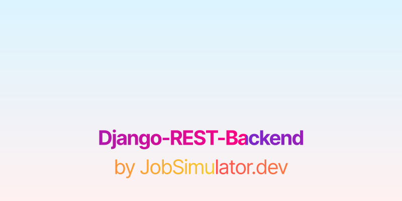

# django-rest-backend by Jobsimulator.dev

This is an Django-based Pokémon REST API based on PokeAPI. Your job is to fix 5 issues:

1. Update `/pokemon` endpoint to include a Pokémon's type.
1. Implement Get Pokémon by ID
1. Implement Get Pokémon by Name
1. Implement Get Pokémon by Type
1. Implement Get Pokémon by HP (with Query Params)
1. Update all endpoints to return Japanese and Chinese characters

Please refer to the API Swagger documentation for clear specifications of the API's intended behavior. You can find the Swagger docs at http://localhost:3000/api-docs.

Once you create a pull request with your changes, our automated test runner will validate your code to check if it is correct. No need for manual review!

## Learning Objectives

You will learn and gain experience with:

- [Django Rest Framework](https://www.django-rest-framework.org/)
- [Django Models](https://docs.djangoproject.com/en/4.1/topics/db/models/)
- [Django Views](https://docs.djangoproject.com/en/4.1/topics/http/views/)
- [Django Serializers](https://www.django-rest-framework.org/api-guide/serializers/)
- [Filtering](https://www.django-rest-framework.org/api-guide/filtering/)
- [HTTP Status Codes](https://www.django-rest-framework.org/api-guide/status-codes)
- [RESTful API Design](https://restfulapi.net/)

## How to start working

1. Fork this repo and clone it locally.
1. enter `src` directory and run `npm install` to install dependencies.
1. run `npm start` to start the development server.
1. Open src/app.js in your IDE to start exploring the codebase.
1. Open http://localhost:3000/api-docs to view the Swagger docs. This is where you can find the API specifications.
1. Fix all the issues (hints are provided as TODO comments in the code)
1. Once all your solutions are complete, create a single Pull Request to this repository
1. Check if your solutions passes our automated tests.

## Need help?

The best way to ask for help is to ask our Discord community.

[Click here to join the Jobsimulator.dev Discord](https://discord.gg/6VsSMZaM7q).

## Want more challenges?

Browse our [list of challenges](https://jobsimulator.gumroad.com/) and [join our Discord](https://discord.gg/6VsSMZaM7q) to get notified when new challenges are released.
